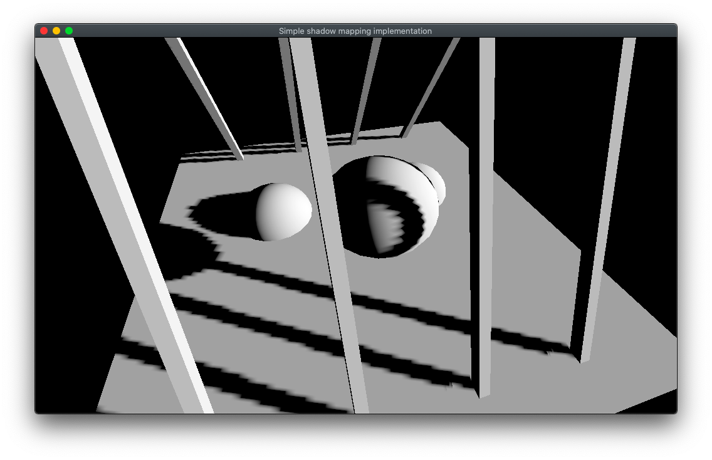
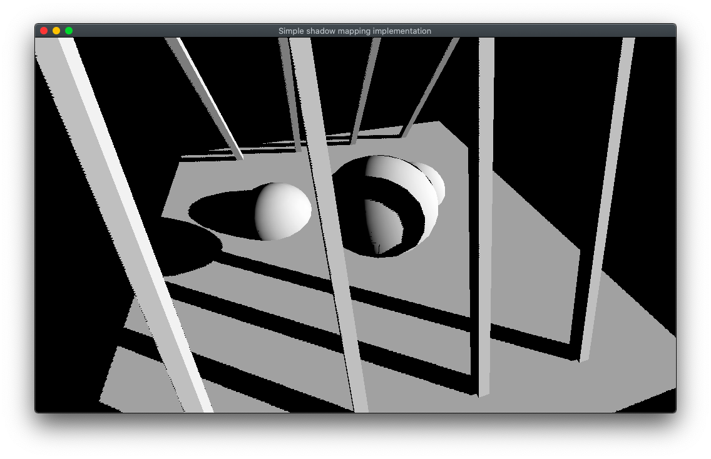

# Welcome

Minimalist implementation of a **custom shadow rendering pipeline in Godot** written in GDScript.

Godot (3.1.1) natively supports shadows but the rendering quality is poor. It seems like a fraction of the shadow map resolution is used.

This project is an attempt to solve this quality issue and lets you compare the shadow quality between the default Godot rendering pipeline and a custom pipeline.
Note that to run efficiently on mobiles, shadow map resolution is set to 1024x1024, blurring and smoothing effects are disabled.

# Controls

Use to keys UP and DOWN to switch between **Godot default** shadow rendering and **custom** shadow rendering.

* Press key UP to show default Godot shadow rendering
* Press key DOWN to show custom shadow rendering
* Drag the mouse to rotate around the scene

# Screenshots

Here are some screenshots to highlight the rendering quality gap with the same shadow map resolution.

*Default shadows*

*Custom shadows*
